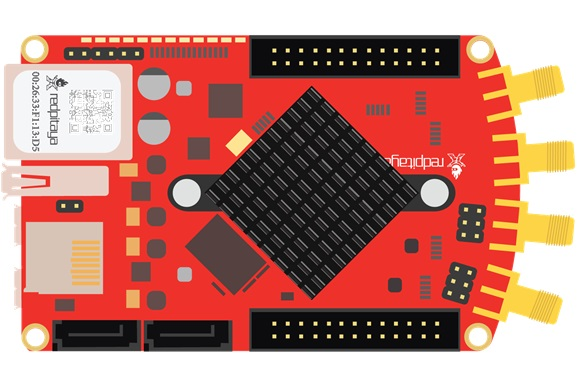
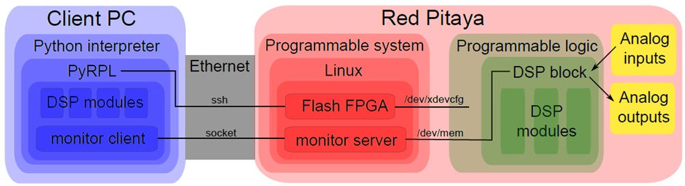
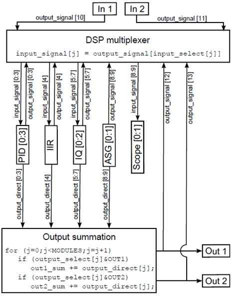
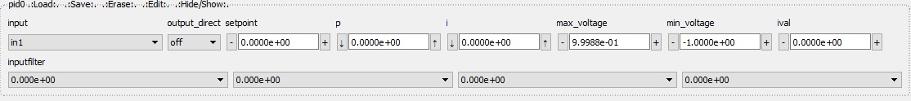

Basics of the PyRPL Architecture
**********************************

This section presents the basic architecture of PyRPL. The main goal here is to quickly give a broad overview of PyRPL's internal logic
without distracting the reader with too many technical details. For a more detailled description of the individual components described in this page, please, refer
to the corresponding section :doc:`developer_guide/index`.

Motivation
===========

Available hardware boards featuring FPGAs, CPUs and analog in- and outputs makes it possible to use digital signal processing (DSP) 
to control quantum optics experiments. Running open-source software on this hardware has many advantages:

- Lab space: small size, less different devices
- Money: cheap hardware, free software
- Time: connect cables once, re-wire digitally automate experiments work from home
- Automated measurements incite to take more data-points perform experiments more reproducibly
  record additional, auxiliary data
- Functionality beyond analog electronics
- Modify or customize instrument functionality

However, learning all the subtelties of FPGA programming, compiling and debugging FPGA code can be extremely time consumming. 
Hence, PyRPL aims at providing a large panel of functionalities on a precompiled FPGA bitfile. These FPGA modules are highly customizable by changing 
register values without the need to recompile the FPGA code written in Hardware Description Language. High-level functionalities are implemented by a python 
package running remotely and controlling the FPGA registers.

Hardware Platform - Red Pitaya
===============================

At the moment, Red Pitaya is the only hardware platform supported by PyRPL.

The RedPitaya board is an affordable FPGA + CPU board running a Linux operating system. The FPGA is running at a clock rate of 125 MSps and 
it is interfaced with 2 analog inputs and 2 analog outputs (14 bits, 125 MSps). The minimum input-output latency is of the order of 200 ns and
the effective resolution is 12 bits for inputs and 13 bits for outputs. 4 slow analog inputs and outputs and 16 I/O ports are also available. 
Visit the The Red Pitaya homepage (http://www.redpitaya.com) for more details on the platform.

Software Infrastructure
=======================

The FPGA functionalities of PyRPL are organized in various DSP modules. These modules can be configured and arbitrarily connected together 
using a python package running on a client computer. This design offers a lot of flexibility in the design and control of various experimental 
setups without having to recompile the FPGA code each time a different fonctionality is needed. A fast ethernet interface maps all FPGA registers 
to Python variables. The read/write time is around 250 microseconds for a typical LAN connection. High-level functionalities are achieved by 
performing successive operations on the FPGA registers using the Python API. A Graphical User Interface is also provided to easily visualize and 
modify the different FPGA registers. We provide a description of the different software components below.

FPGA modules
------------

At the moment, the FPGA code provided with PyRPL implements various Digital Signal Processing modules:

+--------------+------------+--------------------------------------------------------+
|  Module name |# available | Short description                                      |
+==============+============+========================================================+
|  Scope       | 1          | A 16384 points, 2 channels oscilloscope                |
|              |            | capable of monitoring internal or external signals     |
+--------------+------------+--------------------------------------------------------+
| ASG          | 2          | An arbitrary signal generator capable of generating    |
|              |            | various waveforms, and even gaussian white noise       |
+--------------+------------+--------------------------------------------------------+
| IQ modulator/| 3          | An internal frequency reference is used to digitally   |
| demodulator  |            | demodulate a given input signal. The frequency         | 
|              |            | reference can be outputed to serve as a driving signal.| 
|              |            | The slowly varying quadratures can also be used to     |
|              |            | remodulate the 2 phase-shifted internal references,    |
|              |            | turning the module                                     |
|              |            | into a very narrow bandpass filter. See the page       |
|              |            | :ref:`iq-widget-label` for more details                |
+--------------+------------+--------------------------------------------------------+
| PID          |  3         | Proportional/Integrator/Differential feedback modules  |
|              |            | (In the current version, the differential gain is      |
|              |            | disabled). The gain of each parameter can be set       |
|              |            | independently and each module is also equiped with a   |
|              |            | 4th order linear filter (applied before the PID        |
|              |            | correction)                                            |
+--------------+------------+--------------------------------------------------------+  
| IIR          | 1          | An Infinite Impulse Response filter that can be used to|
|              |            | realize real-time filters with comlex                  |
|              |            | transfer-functions                                     |
+--------------+------------+--------------------------------------------------------+
| Trigger      | 1          | A module to detect a transition on an analog signal.   |
+--------------+------------+--------------------------------------------------------+
| Sampler      | 1          | A module to sample each external or external signal    |
+--------------+------------+--------------------------------------------------------+
| Pwm          | 4          | Modules to control the pulse width modulation pins of  |
|              |            | the redpitaya                                          |
+--------------+------------+--------------------------------------------------------+
| Hk           | 1          | House keeping module to monitor redpitaya constants and|
|              |            | control the LED status                                 |
+--------------+------------+--------------------------------------------------------+

Modules can be connected to each other arbitrarily. For this purpose, the modules contain a generic register **input_select** (except for ASG).
Connecting the **output_signal** of submodule **i** to the **input_signal** of submodule **j** is done by setting the register **input_select[j]** to **i**;

Similarly, a second, possibly different output is allowed for each module (except for scope and trigger): **output_direct**.
This output is added to the analog output 1 and/or 2 depending on the value of the register **output_select**.

The routing of digital signals within the different FPGA modules is handled by a DSP multiplexer coded in VHDL in the file `red_pitaya_dsp.v <https://github.com/lneuhaus/pyrpl/blob/master/pyrpl/fpga/rtl/red_pitaya_dsp.v>`_.
An illustration of the DSP module's principle is provided below:

Monitor Server
---------------

The monitor server is a lightweight application written in C (the source code is in the file `monitor_server.c <https://github.com/lneuhaus/pyrpl/blob/master/pyrpl/monitor_server/monitor_server.c>`_) and running on the redpitaya OS to allow remote writing and monitoring of FPGA registers.

The program is launched on the redpitaya with (automatically done at startup)::

   ./monitor-server PORT-NUMBER, where the default port number is 2222.  

We allow for bidirectional data transfer. The client (python program) connects to the server, which in return accepts the connection. 
The client sends 8 bytes of data:

- Byte 1 is interpreted as a character: 'r' for read and 'w' for write, and 'c' for close. All other messages are ignored. 
- Byte 2 is reserved. 
- Bytes 3+4 are interpreted as unsigned int. This number n is the amount of 4-byte-units to be read or written. Maximum is 2^16. 
- Bytes 5-8 are the start address to be written to. 

If the command is read, the server will then send the requested 4*n bytes to the client. 
If the command is write, the server will wait for 4*n bytes of data from the server and write them to the designated FPGA address space. 
If the command is close, or if the connection is broken, the server program will terminate. 

After this, the server will wait for the next command.

Python package PyRPL
-----------------------

The python package PyRPL defines all the necessary tools to abstract the communication layer between the client-computer and the redpitaya.
In this way, it is possible to manipulate FPGA registers transparently, as if they were simple attributes of local python objects. 
We give here a brief overview of the main python objects in PyRPL.

The Module class
+++++++++++++++++

Each FPGA module has a python counterpart: an instance of the class HardwareModule. The inheritance diagram of all HardwareModules is represented below:

.. inheritance-diagram:: pyrpl.hardware_modules.scope.Scope pyrpl.hardware_modules.iq.Iq pyrpl.hardware_modules.pid.Pid pyrpl.hardware_modules.iir.IIR pyrpl.hardware_modules.trig.Trig  pyrpl.hardware_modules.sampler.Sampler pyrpl.hardware_modules.pwm.Pwm 
   :parts: 1

For more complex functionalities, such as those involving the concurrent use of several FPGA modules, 
purely software modules can be created. Those modules only inherit from the base class Module and they don't have an FPGA counterpart. Below, the inheritance diagram of all software modules:

.. inheritance-diagram:: pyrpl.software_modules.Lockbox pyrpl.software_modules.NetworkAnalyzer pyrpl.software_modules.SpectrumAnalyzer pyrpl.software_modules.SoftwarePidLoop pyrpl.software_modules.CurveViewer pyrpl.software_modules.Loop pyrpl.software_modules.PyrplConfig pyrpl.software_modules.Iqs pyrpl.software_modules.Asgs pyrpl.software_modules.Scopes pyrpl.software_modules.Iirs pyrpl.software_modules.Trigs
   :parts: 1

In addition, to prevent a hardware resource from being used twice, HardwareModules should be accessed via the ModuleManagers which takes care of reserving them for a specific user or Module. For example:

.. code-block:: python

    # import pyrpl library
    from pyrpl import Pyrpl

    # create an interface to the Red Pitaya
    pyrpl = Pyrpl()

   # reserve the scope for user 'username'
    with pyrpl.scopes.pop('username') as mod:
         curve = mod.single() # acquire a curve
   # The scope is freed for latter use at this point

The Proprety descriptors
+++++++++++++++++++++++++

HardwareModules are essentially a list of FPGA registers that can be accessed transparently such as on the following example:

.. code-block:: python

    # import pyrpl library
    import pyrpl

    # create an interface to the Red Pitaya
    r = pyrpl.Pyrpl().redpitaya

    print(r.hk.led) # print the current led pattern

    r.hk.led = 0b10101010  # change led pattern

Changing a register's value should trigger the following actions:

- communicating the new value to the monitor_server for the FPGA update via a TCP-IP socket.
- the new value should be saved on-disk to restore the system in the same state at the next startup.
- in case a Graphical User Interface is running, the displayed value should be updated.

To make sure all these actions are triggered by the simple python affectation, we use a `descriptor <https://docs.python.org/2/howto/descriptor.html>`_ pattern. The idea is to define 
setter and getter functions inside an auxilary "descriptor" class. The diagram below shows the inheritance diagram for the most common attribute descriptor types.

.. inheritance-diagram:: pyrpl.attributes.IntRegister pyrpl.attributes.SelectRegister pyrpl.attributes.FilterRegister pyrpl.attributes.BoolRegister pyrpl.attributes.FloatRegister 
   :parts: 1

As for the distinction between software modules and hardware modules above, the properties that inherit from BaseRegister are directly mapping an FPGA register. 
On the other hand, software modules are using properties that are not in direct correspondance with an FPGA register. However, since they inherit from BaseAttribute, 
the load/save and GUI update mechanism is still implemented.

Module states
++++++++++++++

An important member of the Module class is the list **_setup_attributes**. This is a list of attribute names forming a subset of all module attributes. The value of the attributes in 
**_setup_attributes** constitutes the current state of the module. When the PyRPL instance has been created with a configuration file, the current state of each module is kept in-sync 
with the configuration file. This is particularly useful for GUI users who would like to keep the previous settings of all modules from one session to the next.

.. warning:: The config file is *not* kept in-sync with modules that are reserved by a user or another module. It is the responsibility of the user-script or owner module to keep track of the slave module state. Moreover, the slave-module is restored to the last current state whenever it becomes free.

The state of a module can be saved for latter use in a separate section of the config file. The following example shows the basic use of the load/save API:

.. code-block:: python
    
    # import pyrpl library
    from pyrpl import Pyrpl

    # create an interface to the Red Pitaya
    scope = Pyrpl('new_config_file').redpitaya.scope

    scope.duration = 1. # set curve duration to 1s
    scope.save_state('slow_scan') # save state with label 'slow_scan'
    scope.duration = 0.01 # set curve duration to 0.01s
    scope.save_state('fast_scan') # save state with label 'fast_scan'
    scope.load_state('slow_scan') # load state 'slow_scan'
    scope.single() # acquire curve with a 1s duration

Automatic GUI creation
+++++++++++++++++++++++++

Designing Graphical User Interface can be a tedious work. However, since module attributes are defined in a uniform fashion across the project, 
most of the GUI creation can be handled automatically. Our GUI is based on the very popular and cross platform library `PyQt <https://riverbankcomputing.com/software/pyqt/intro>`_ 
in conjonction with the `qtpy <https://pypi.python.org/pypi/QtPy>`_ abstraction layer to make PyRPL compatible with PyQt4, PyQt5 and PySide APIs.

Each PyRPL module is represented by a widget in the Main PyRPL window. The list of attributes to display in the GUI is defined in the Module class by the class member **_gui_attributes**.
When the module widget is created, sub-widgets are automatically created to manipulate the value of each attribute listed in **_gui_attributes**.

Example: definition of the Pid class
++++++++++++++++++++++++++++++++++++++

The following is extracted from `pid.py <https://github.com/lneuhaus/pyrpl/blob/master/pyrpl/hardware_modules/pid.py>`_

.. code-block:: python

    class Pid(FilterModule):
	# Type of widget to use for this Module class
	# should derive from ModuleWidget
        _widget_class = PidWidget

	# QObject used to communicate with the widget
        _signal_launcher = SignalLauncherPid
        
	# List of attributes forming the module state
	_setup_attributes = ["input", # defined in base class FilterModule
                             "output_direct", # defined in base class FilterModule
                             "setpoint",
                             "p",
                             "i",
                             #"d", # Not implemented in the current version of PyRPL
                             "inputfilter",
                             "max_voltage",
                             "min_voltage"]

	# list of attribtue to display in the GUI
        _gui_attributes = _setup_attributes + ["ival"]
    
        # Actions to perform immediately after a state has been loaded
        def _setup(self):
            """
            sets up the pid (just setting the attributes is OK).
            """
            pass
       
	# Below are the different attributes of a PID module (mostly registers)

        ival = IValAttribute(min=-4, max=4, increment= 8. / 2**16, doc="Current "
                "value of the integrator memory (i.e. pid output voltage offset)")
    
        setpoint = FloatRegister(0x104, bits=14, norm= 2 **13,
                                 doc="pid setpoint [volts]")
    
        min_voltage = FloatRegister(0x124, bits=14, norm= 2 **13,
                                    doc="minimum output signal [volts]")
        max_voltage = FloatRegister(0x128, bits=14, norm= 2 **13,
                                    doc="maximum output signal [volts]")
    
        p = GainRegister(0x108, bits=_GAINBITS, norm= 2 **_PSR,
                          doc="pid proportional gain [1]")
        i = GainRegister(0x10C, bits=_GAINBITS, norm= 2 **_ISR * 2.0 * np.pi *
                                                      8e-9,
                          doc="pid integral unity-gain frequency [Hz]")
 	(...)

The generated widget is represented below:

