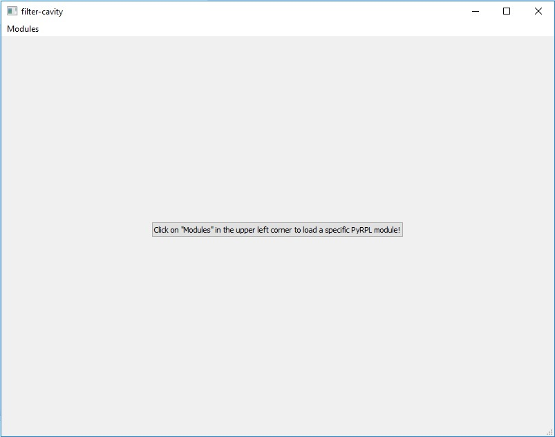
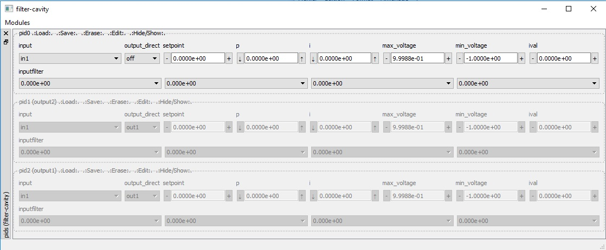
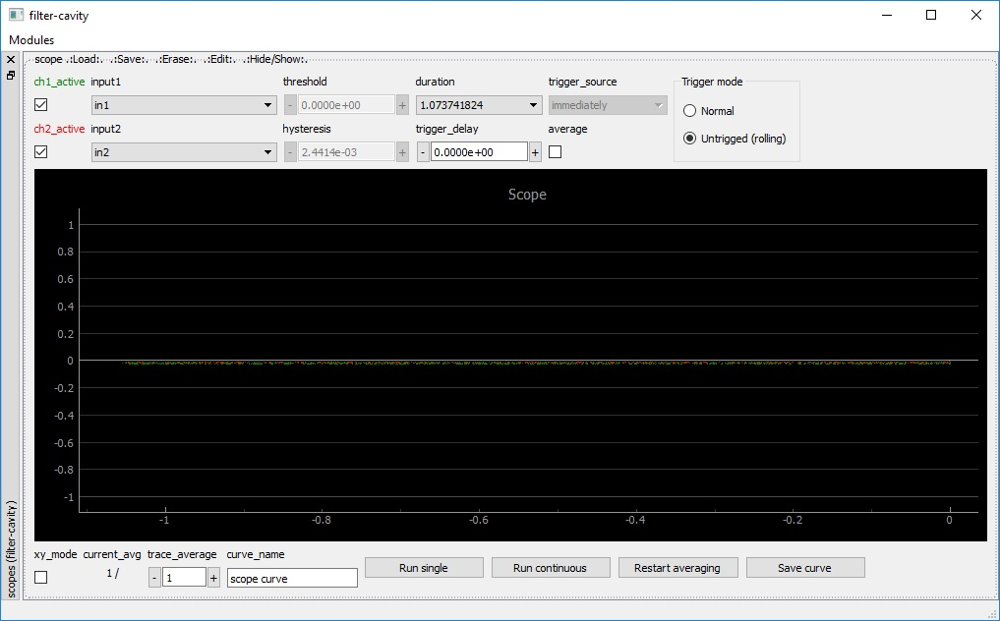
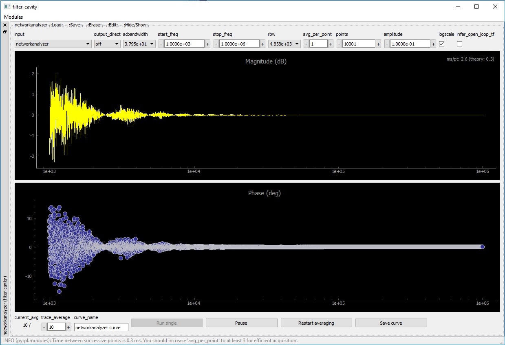
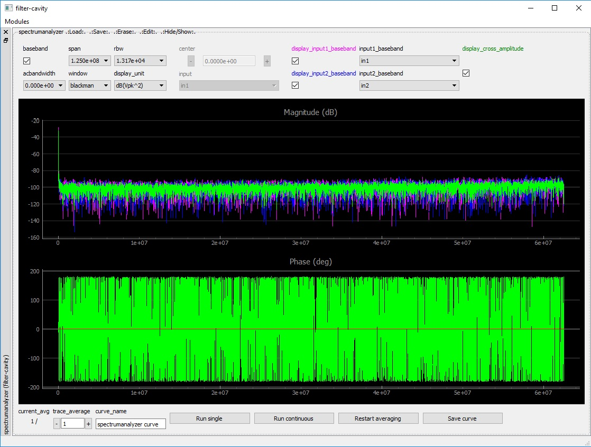
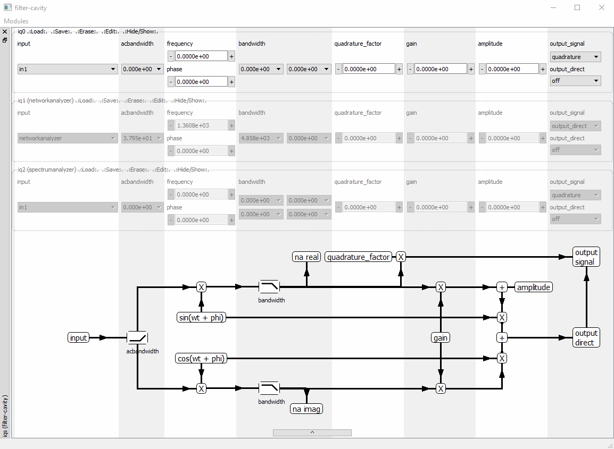
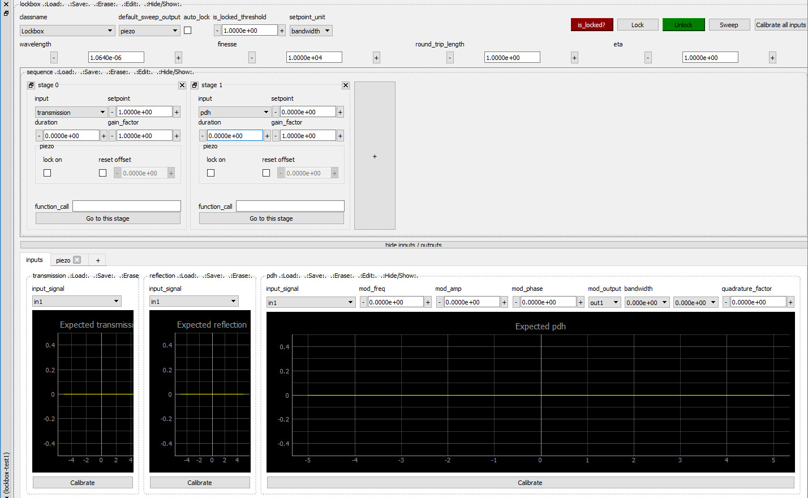

GUI instruments manual
*************************

In this section, we show how to control the main modules of Pyrpl with the Graphical User Interface (GUI).

Video tutorial
================

Get started by watching the video tutorial below on locking a Michelson
interferometer with PyRPL. The video covers:

- how to set up the hardware for a typical Red Pitaya use case (interferometer locking)
- how to get started by :ref:`start_gui-label`
- how to use the :ref:`scope-widget-label` and Arbitrary Signal Generator GUI
- how to set up and configure the :ref:`lockbox-widget-label`
- how to measure a transfer function with the :ref:`na-widget-label`

.. raw:: html

   <iframe width="560" height="315" src="http://www.youtube.com/embed/WnFkz1adhgs?rel=0" frameborder="0" allowfullscreen></iframe>

.. _start_gui-label:

Starting the GUI
================

If you use the `windows or linux binary files  <https://sourceforge.net/projects/pyrpl/files/>`_,
just launch the executable and the GUI should start. Passing the command-line
argument :code:`--help` to the executable shows a list of optional
command-line arguments.

If instead you have :ref:`a source code installation <_installation_from_source>`,
then you can either launch PyRPL from a terminal with

.. code-block:: bash

    python -m pyrpl example_filename

or execute the following code block in Python:

.. code-block:: python

    # import pyrpl library
    import pyrpl

    # create a Pyrpl object and store the configuration in a file 'example_filename.yml'
    # by default, the parameter 'gui' is set to True
    p = pyrpl.Pyrpl(config='example_filename')

If you are using the file 'example_filename.yml' for the first time, a screen will pop-up
asking you to choose among the different RedPitayas connected to your local network. After that, 
the main Pyrpl widget should appear:

The main pyrpl widget is initially empty, however, you can use the "modules" menu to populate it 
with module widgets. The module widgets can be closed or reopened at any time, docked/undocked 
from the main module window by drag-and-drop on their sidebar, and their position on screen will be
saved in the config file for the next startup.

We explain the operation of the most useful module widgets in the following sections.

.. _typical-widget-label:

A typical module widget: PID module
====================================

The image below shows a typical module widget, here for the PID modules.

.. automodule:: pyrpl.widgets.module_widgets.base_module_widget

.. _acquisition-widget-label:

Acquisition Module Widgets
=============================

.. automodule:: pyrpl.widgets.module_widgets.acquisition_module_widget

.. _scope-widget-label:

Scope Widget
---------------

The scope widget is represented in the image below.

.. automodule:: pyrpl.widgets.module_widgets.scope_widget

.. _na-widget-label:

Network Analyzer Widget
--------------------------

The network analyzer widget is represented in the image below.

.. automodule:: pyrpl.widgets.module_widgets.na_widget

.. _specan-widget-label:

Spectrum Analyzer Widget
---------------------------

The spectrum analyzer widget is represented in the image below.

.. automodule:: pyrpl.widgets.module_widgets.spec_an_widget

.. warning:: Because the spectrum analyzer uses the data sampled by the scope to perform measurements,
             it is not possible to use both instruments simultaneaously. When the spectrum-analyzer is running,
             the scope-widget appears greyed-out to show that it is not available.

.. _iq-widget-label:

Iq Widget
===================

The iq widget is represented in the image below. A schematic of the internal connection of the IQ-module can be 
shown or hidden with the arrow button.

.. automodule:: pyrpl.widgets.module_widgets.iq_widget

.. _lockbox-widget-label:

Lockbox Widget
===================

The lockbox widget is represented in the image below.

.. automodule:: pyrpl.widgets.module_widgets.lockbox_widget
