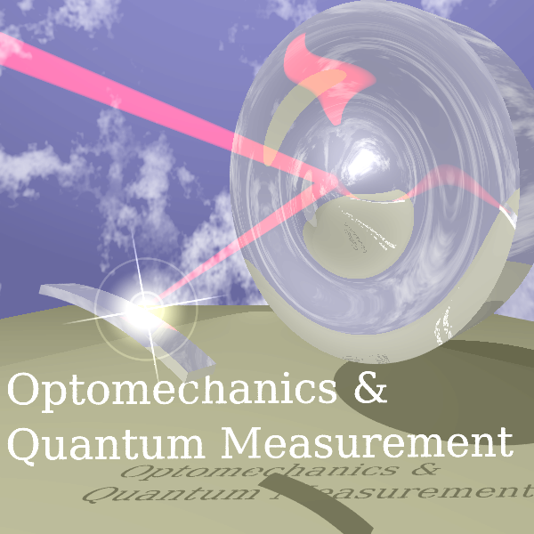
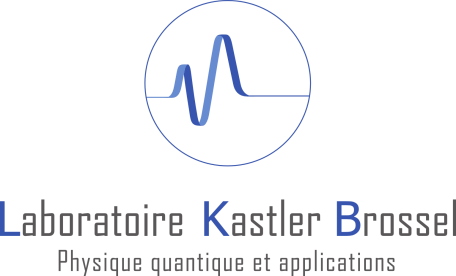
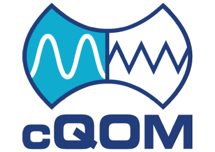
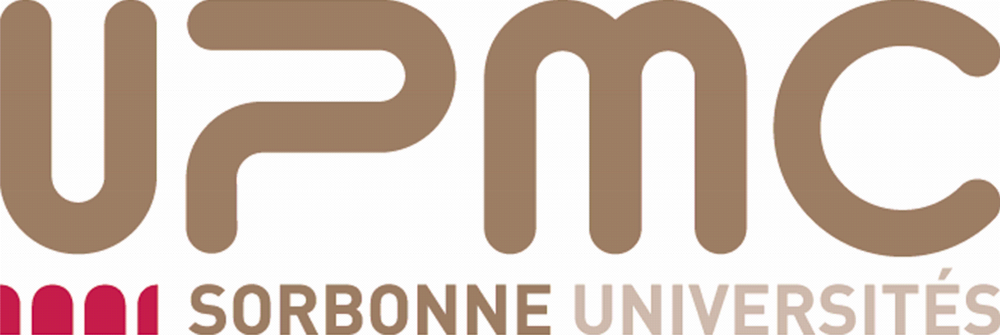

Contributors
**************

Below is partial list of PyRPL contributors. We do our best to keep this list updated.
If you've been left off, please change this file by yourself or send an email to the
maintainer (currently neuhaus@lkb.upmc.fr).

* Leonhard Neuhaus
* Samuel Deléglise
* Jonas Neergard-Nielsen
* Xueshi Guo
* Jerome Degallaix
* Pierre Clade
* Matthew Winchester
* Remi Metzdorff
* Kevin Makles
* Clement Chardin

Funding and support
**********************

Work on PyRPL was partially funded and/or supported by the following organizations:

.. image:: logos/CNRS.png
  :target: http://www.cnrs.fr/
  :width: 16%

* `Optomechanics and Quantum Measurement Group <http://www.lkb.upmc.fr/optomecanics/>`_ at the `Laboratoire Kastler Brossel in Paris <http://www.lkb.upmc.fr/>`_
* `Agence nationale de recherche (ANR) <http://www.agence-nationale-recherche.fr/>`_
* `Marie Curie Initial Training Network (ITN) "Cavity Quantum OptoMechanics" (CQOM) <http://www.cqom-itn.net/>`_
* `Centre National de la Recherche Scientifique (CNRS) <http://www.cnrs.fr/>`_
* `Universite Pierre et Marie Curie (UPMC) <http://www.upmc.fr/en/>`_

About
*********

PyRPL is open source software that allows to use FPGA boards with
analog interfaces for measurement and control of real-world devices in
physics and engineering, notably experiments in quantum optics. It was
started in 2014 by Leonhard Neuhaus for controlling experiments in the field
of quantum physics at the Laboratoire Kastler Brossel in Paris, France.
Its was initially based on the open-source code for the `Red Pitaya <www.redpitaya.com>`_
and gradually diverged away from it. In 2016, large parts of the graphical
user interface were added to the project by Samuel Deleglise. PyRPL was finally
published as an open-source project under the GNU General Public License, Version 3
and has been online since July 2017.
