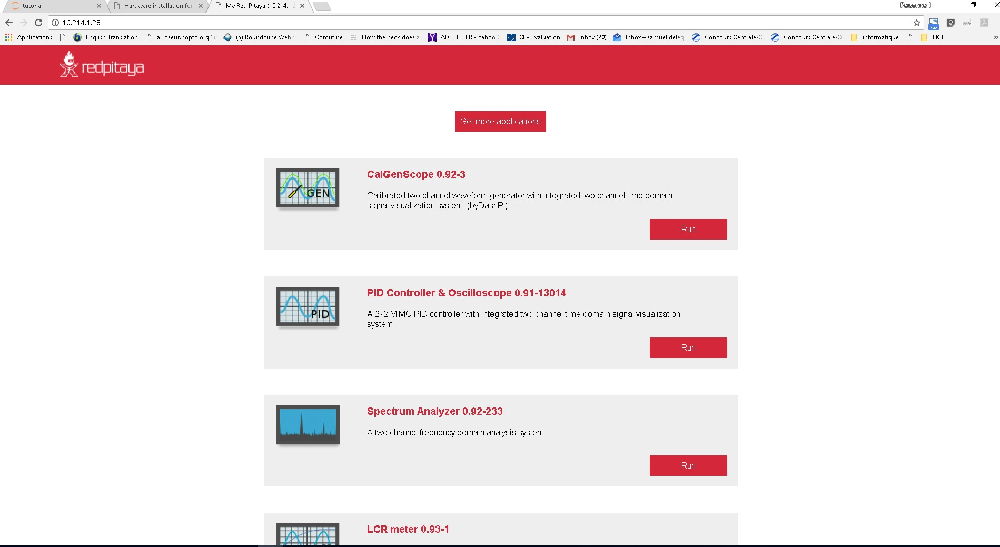

Hardware installation for PyRPL
*********************************

The `RedPitaya <http://redpitaya.readthedocs.io/en/latest/>`_ is an affordable FPGA board with fast analog inputs and outputs. PyRPL implements a large number of measurement and real-time feedback instruments for the Red Pitaya. For PyRPL to work, you must have a working `Red Pitaya / StemLab <http://www.redpitaya.com>`_ connected to the same local area network (LAN) as the computer PyRPL is running on. PyRPL is compatible with all operating system versions of the Red Pitaya and does not require any customization of the Red Pitaya. If you have not already set up your Red Pitaya, you have two options: :ref:`sdcard_092` or :ref:`sdcard_quick`. You should :ref:`sdcard_check` at the end.

.. _sdcard_092:

Install a minimum-weight SD card (recommended)
================================================

Just download and unzip the `Red Pitaya OS Version 0.92 image <https://sourceforge.net/projects/pyrpl/files/SD_Card_RedPitayaOS_v0.92.img.zip/download>`_. Flash this image on a >= 4 GB SD card using a tool like `Win32DiskImager <https://sourceforge.net/projects/win32diskimager/>`_, and insert the card into your Red Pitaya. Hook up the Red Pitaya to the LAN, connect its power supply and continue with :ref:`installing_pyrpl`.

.. _sdcard_official:

Follow the official documentation
==================================
Follow the quick start steps of the `official Red Pitaya documentation <http://redpitaya.readthedocs.io/en/latest/>`_ until you can somehow access the Red Pitaya from your computer. You are then ready for :ref:`installing_pyrpl`.

.. _sdcard_check:

Check that it is working
================================

The fastest way to check that the Red Pitaya is working is simply to launch PyRPL and let it automatically discover the Red Pitaya device. If this does not work, you may want to ensure that the Red Pitaya and SD card are actually working together.

To make sure the SD card is bootable, insert it into the slot of the Redpitaya and plug the power supply. Connect the redpitaya to your local network with an ethernet cable and enter the IP-adress of the repitaya into an internet browser.
The redpitaya welcome screen should show-up!

   This is the Redpitaya welcome screen.

